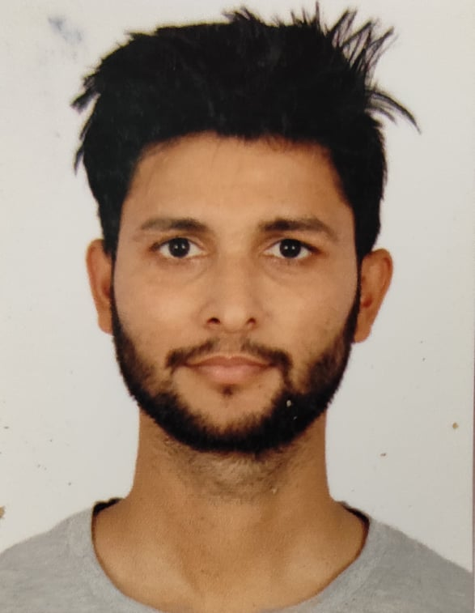

🚀 Er. Gokul Dev Joshi

🎓 Civil Engineer | Lecturer | Water Resources Specialist
📍 Kathmandu, Nepal
📧 gokuljoshi349@gmail.com
 | 📱 +977-9868896517

🌟 About Me

👋 Hello! I am Er. Gokul Dev Joshi, a passionate Civil Engineer and Lecturer with expertise in:

💧 Water Resources Engineering
🏗️ Structural Design & Analysis
🌱 Sustainable Infrastructure
📊 Research & Academic Development

I specialize in bridging academic knowledge with real-world engineering solutions, especially in rural water supply, hydropower, and land-water systems.

🎓 Education

🎓 M.Sc. in Land & Water Engineering
📍 IOE, Tribhuvan University (Purwanchal Campus) – 2077 B.S.

🎓 Bachelor in Civil Engineering
📍 IOE, Tribhuvan University (Paschimanchal Campus) – 2072 B.S.

💼 Professional Experience
🧑‍🏫 Lecturer

🏫 Universal Engineering and Science College, Lalitpur
📅 2023 – Present

🎓 Assistant Professor

🏫 Madan Bhandari Memorial Academy, Morang
📅 2019 – 2023

🏗️ Project Engineer

🌍 Rural Village Water Resource Management Project (RVWRMP)
📅 2016 – 2018

🔹 Planning, monitoring & supervision
🔹 Design of rural water supply & irrigation systems
🔹 Micro-hydro & multiple-use systems (MUS)

🏢 Engineer

🏗️ The Perfect Engineering Consultancy, Pokhara
📅 2015 – 2016

🔹 Building design & analysis
🔹 Construction supervision
🔹 Property valuation

🔬 Research & Publications

📄 Performance Assessment of Water Supply Scheme (2020)
📄 Rooftop Rainwater Harvesting in Nepal (2021)

💡 Focus Areas:

Water supply systems
Climate resilience
Sustainable engineering
🧠 Skills & Expertise

🛠️ Technical Skills

Structural Design & Analysis
Hydrology & Hydraulics
Irrigation Engineering
Engineering Drawing & Estimation

💻 Software Skills

AutoCAD 🖥️
MS Excel 📊
MS Word 📄
🏗️ Key Projects

🌉 Hydraulic Design of Garuwa Khola Bridge
🗺️ Land Use Mapping with Cadastral Superimpose
💧 Rural Water Supply & Irrigation Systems

🧑‍🏫 Teaching Areas

📘 Fluid Mechanics
📘 Hydraulics
📘 Engineering Hydrology
📘 Hydropower Engineering

🏅 Training & Conferences

🎓 Advanced Training – IIT Kharagpur, India
🌍 International Conference on Water & Climate Change
📊 Research Presentation on Water Supply Systems

🌐 Connect With Me

📧 Email: gokuljoshi349@gmail.com

📱 Phone: +977-9868896517